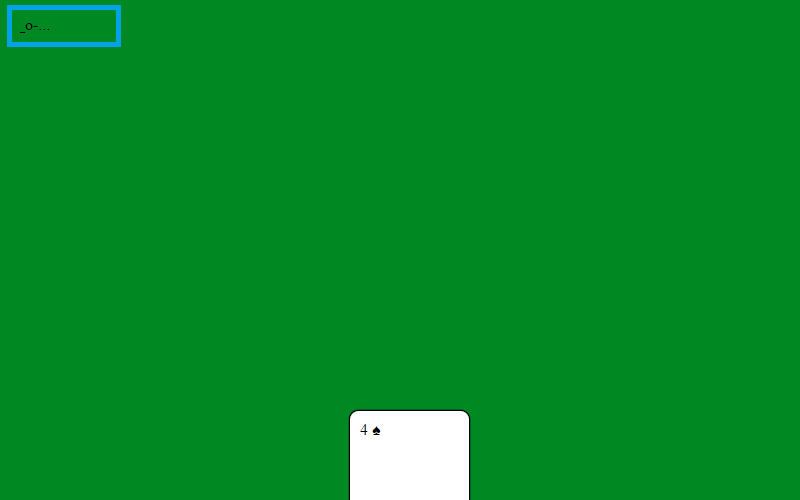
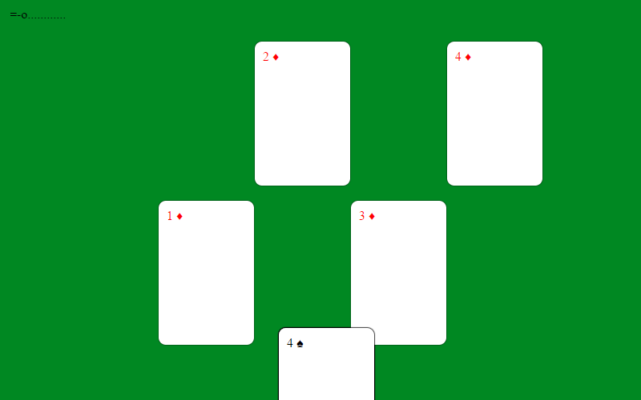

pick a card
====

An stunning magic card trick. Use the microphone to communicate to your computer the picked card.

[](https://app.wercker.com/project/byKey/f21ee725f958495748dc0f2b34140572)

[play](https://platane.github.io/js1k-2017/8185a4e7587a52c6f5a8c52860db6e5df972ef86/index.html)

[version history](https://platane.github.io/js1k-2017/)

# Usage

Present the screen to your audience.
Ask them to pick a card and to memorize it.

Place the card in deck mode by clicking anywhere on the screen.

Now ask to murmur to your ear what the card was.

Improvise a goofy dance to transmit the picked card as a sequence of clap. 👏

The card appear on screen without you interacting with the computer. 😮


# Sequence

The clap sequence consist in a start clap, followed by 4 times where you should clap or not clap.

```
starting clap 
    |
    v
   -x---------------------x---------------------x-------------------x-------------------x----->
                    color is ⚫         card is ♠️️️️ or ♦️️       value is peer           value > 2
                        -> 👏                 -> 👏               -> 👏               -> 👏
                                        ( aka the symbol
                                          is pointy or top )

```

_example :_

The audience pick the 3 ♦️.


* The card is 🔴         ->  x
* The symbol is pointy   ->  👏
* The value is not peer  ->   x
* The value is > 2       ->  👏

The clap sequence is ( 👏 to start )   ...x...👏...x...👏


> It's important that you determine and memorize the clap sequence before starting to clap so you can distract the audience with an elaborated dance.


# Training

## hint

It can be hard to guess the perfect timing, to train, notice that you have a hint on the top left corner of the screen.



The hint looks like `=oo-....` which can be split in 3 parts:
```
    =           |         oo-             |       ....
audio level     |    current sequence     |   delay until next clap check
```

> The hint is meant to be discrete, so your audience does not suspect a thing.

## training mode


To practice this trick, you can enter "trainig mode" by clicking on the cards, rather than on the green rug.



In training mode, the interval between two clap check is larger, and cards will align to show you when you have to clap or not.

> The card on the first row are the ones selected if you clap at the next check. The second row are the ones selected if you do not clap.

